# One Sample Diffusion Model in Projection Domain for Low-Dose CT Imaging
<cite>* Authors: [[Bin Huang]], [[Liu Zhang]], [[Shiyu Lu]], [[Boyu Lin]], [[Weiwen Wu]], [[Qiegen Liu]]</cite>

* Date: [[2022-12-07]]

* URL: [http://arxiv.org/abs/2212.03630](http://arxiv.org/abs/2212.03630)

* DOI: [10.48550/arXiv.2212.03630](https://doi.org/10.48550/arXiv.2212.03630)

* Tags: #Computer-Science---Computer-Vision-and-Pattern-Recognition, #Electrical-Engineering-and-Systems-Science---Image-and-Video-Processing

* [Local library](zotero://select/items/1_ICCKQH9P)

* PDF Attachments
	- [Huang et al_2022_One Sample Diffusion Model in Projection Domain for Low-Dose CT Imaging.pdf](zotero://open-pdf/library/items/QHLIPVEL) 

***

## 1 介绍

### 1.1 Abstract

·在低剂量CT重建的投影域提出一个无监督的单样本扩散模型(OSDM)。

·首先在一个sinogram上训练一个基于得分的生成模型，从Structural-Hankel矩阵中提取出大量的张量作为网络输入来捕获先验分布。然后在推理阶段，迭代执行随机微分方程求解器和数据一致性步骤，得到sinogram数据。最后，通过fbp算法获得最终的图像。

### 1.2 Introduction

·“Our main idea is to learn the prior distribution from normal-dose sinogram by the diffusion model and infer the lost information from low-dose sinogram” (Huang 等, 2022, p. 2) 🔤我们的主要思想是通过扩散模型从正常剂量sinogram中学习先验分布，从低剂量sinogram中推断丢失的信息🔤

·Theoretical and practical contributions:  
①构建低秩Hankel矩阵推断CT sinogram的内部统计量可以缓解医学样本不足的问题，只要一个样本就可以提取足够的先验信息。②采用基于分数的扩散模型进行投影域插值。随着训练集或测试集的变化，所提出的方法在不重新训练模型的情况下保持了很好的泛化性。

## 2 Preliminary

### 2.1 低剂量CT图像重建

·x ∈ RN 代表退化的sinogram图像，sinogram重建的前向过程可以表示为  
                        y = x + n  
其中，n ∈ RM 代表添加的噪声，y代表低剂量的sinogram，这里重建的逆问题是指从y中恢复x。

·为了避免不适定性，将CT sinograms建模为约束优化问题：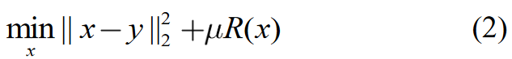  
前一项代表数据保真项，后一项R(x)代表正则先验知识项，选取为全变分(TV)半范数。u是数据一致性项和正则化项之间平衡的因子。

·TV项能够在优化过程中区分方程的很多解，公式2能够挑选出具有期望图像特性的最佳图像作为重建的sinogram，一般情况下，TV定义为：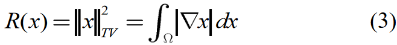  
Ω代表边界域，∇x代表sinogram x的梯度。（ps：正则化项能够控制参数范围从而减少模型容量，防止过拟合）

### 2.2 构建Hankel矩阵

·Hankel矩阵能够从数据冗余中抽取出低剂量CT sinogram的内在统计量，基于低秩矩阵能够表示投影数据的思想，设计一种新的数据形式来表示sinogram的内在联系。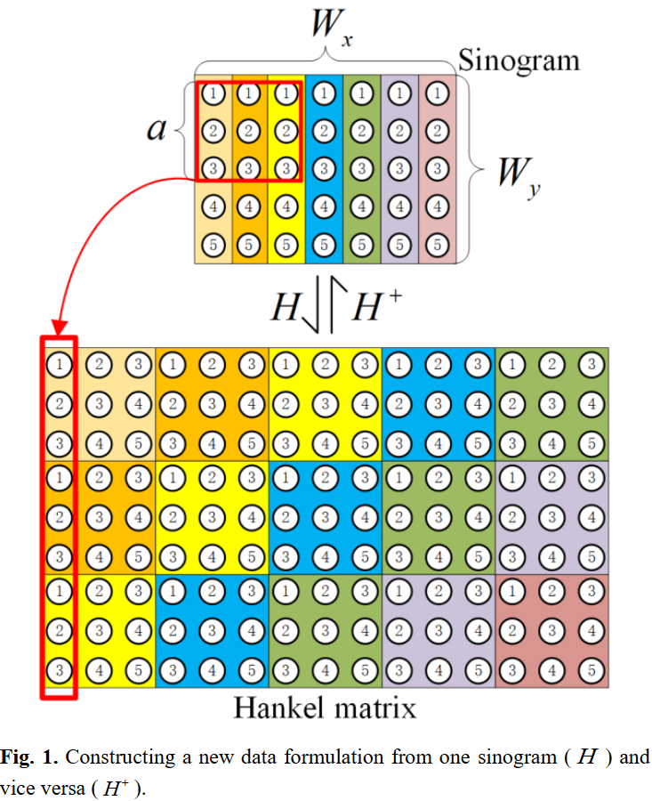滑动窗口设置为 a × a，sinogram为Wx × Wy，进行转换之后，新形式生成的大小为a² × (Wx - a + 1)(Wy - a + 1)。

·在新的数据形式中，投影域中独立块的数据转换为列，线性操作算子H被定义为从以向量形式串联的sinogram中生成新的数据形式：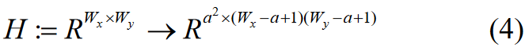

· 逆向过程中多个反对角线项被平均存储在投影域中，因此反向算子H+从新的数据形式中生成相应的投影数据集：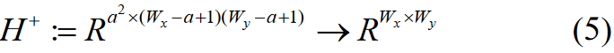  
相当于将反对角线元素取平均并放在合适的位置。

### 2.3 基于分数的随机微分方程

·给定一个连续扩散过程{x(t)}t=0T，x(t) ∈ RN以 t ∈ [0, T] 作为进程时间变量，N是sinogram的维度，扩散过程可以表示为以下SDE的解：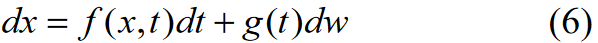 
其中，f(x, t) ∈ RN 以及 g(t) ∈ R分别对应漂移系数和扩散系数，dt对应一个无穷小的正时间步长，w ∈ RN 诱导布朗运动。

·通过对上述过程求逆可得到样本，逆向SDE也是一个扩散过程，可以表示为：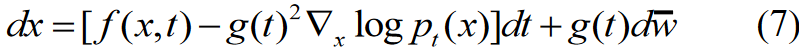  
w-是时间从T向后流动到0的标准wiener process，dt是无穷小的负时间步长。

## 3 Proposed Method

### 3.1 Low-dose CT Imaging Model

·如图，n定义为sinogram中的low-dose noise，I代表CT图像，T(·)对应拉动变换。如果n存在的情况下测量一个大小为768×768的ideal sinogram x，那么CT重建问题在形式上可以表述为等式：y = T(I) + n = x + n  
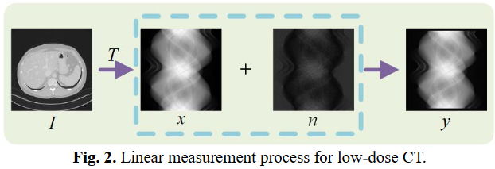
其中，y是大小为768×768的low-dose CT投影数据，并且T-1(·)可以通过逆Radon变换实现。

·根据大量真实投影数据的实验，降低当前强度扫描出的sinogram可以近似看作是ideal projection data被加性噪声污染的结果。加性噪声近似服从泊松分布，强度测量的泊松模型如下：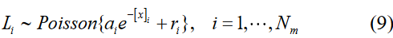  
其中，Li表示透射光子数，ai表示第i条射线的X射线源强度，ri表示散射和电噪声的背景贡献。x表示衰减系数的向量，Nm表示测量次数，Nv表示图像体素数。

·通过取对数运算，将测量数据转换为加权高斯形式：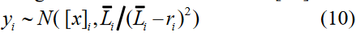  
其中，Li- = E[Li]，low-dose CT问题被表示为一个典型的反问题，为了解决不确定的不适定问题，通过贝叶斯反演理论引入后验分布P(x|y)，从而将反问题转换为以测量y为条件的问题。

### 3.2 Data Preprocessing

·在初始normal-dose projection data上滑动一个大小为8×8的窗口，构造大小为579121×64的Hankel矩阵。经过Hankel变换后，初始的normal-dose projection data中的相同信息出现在Hankel矩阵的不同位置。因此，利用**Hankel矩阵的冗余性**可以获得normal-dose projection data的内部统计信息，**这里只需要一个normal-dose sinogram**。

·假设将初始化normal-dose projection data表示为x，Hankel矩阵H的构造过程为：  
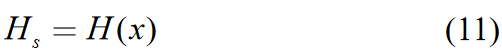  
其中，H(·)对应Hankel转换并且Hs表示构造的Hankel矩阵。构建出的Hankel矩阵以随机的方式分裂出大量的小斑块，具体过程表示为：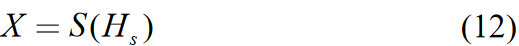 
其中，S(·)表示随机拆分操作，X表示高维张量。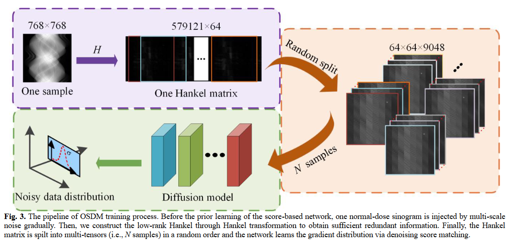

·基于分数的模型通过利用SDE学习先验分布。前向SDE通过缓慢注入噪声，将复杂的数据分布平滑地转换为已知的先验分布。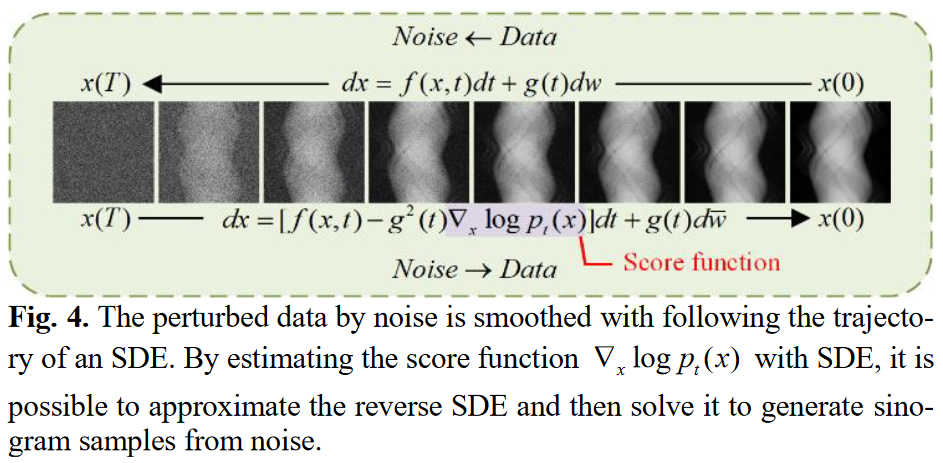

·在训练阶段要优化的目标函数（基于分数的网络的参数）可以表示为：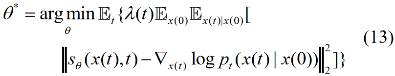 
其中，pt(x(t) | x(0))是以x(0)为中心的高斯扰动核。一旦网络满足sθ(x(t),t) ≈ ▽xlog pt(x)，意味着▽xlog pt(x)通过求解sθ(x(t),t)对所有t都是已知的。

### 3.3 OSDM: Iterative Reconstruction

·首先对CT图像I进行正向投影(FP)变换得到sinogram x：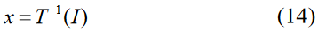

·通过逆向SDE将随机噪声转化为数据进行采样，在样本更新步骤中引入预测-校正(PC)采样，预测器被认为是逆向SDE的数值求解器。当逆向偏移过程结束时，根据先验分布生成样本，可将其离散化：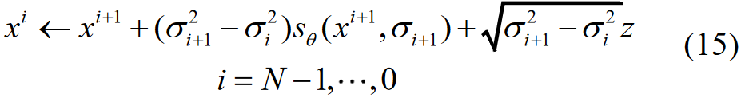 
其中，z~N(0,1)，x(0)~p0，σ0 = 0来简化表示，对 i = N-1,…, 0重复上述公式。在公式17中加入条件约束后，公式可改写为：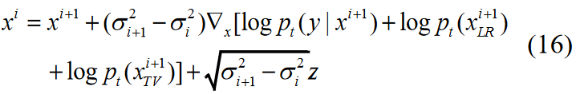  
其中，log pt(y|x)来源于sinogram的数据知识，log pt(xLR)来源于LR的数据知识，log pt(xTV)来源于TV的数据知识。

·因此，通过Hankel变换(HT)操作将更新后的样本x转换为新的数据形式：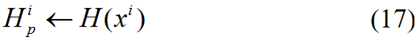

·LR Step：通过SVD将Hankel矩阵分解为式18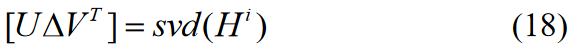  
其中，U和V是正交矩阵，**△**是一个对角元素非负的对角矩阵。

·TV Step：TV最小化操作也用于去除噪声和伪影。假设 **△**x = ||x-xi|| 则TV最小化表示为：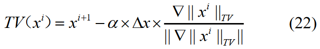  
其中α是梯度下降步的长度。

DC Step：在目标函数中加入投影数据统计特征的方法可以提高抗噪性能，并且对于sinogram去噪们可以通过PWLS方法从含噪sinogram中寻找一个最优的sinogram估值。将PWLS先验纳入正则化目标函数中，正则化目标函数可以表示为：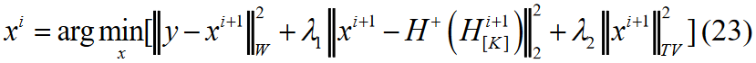  
超参数 λ1, λ2 用于平衡 PWLS, LR, TV。标准PWLS过程描述如下：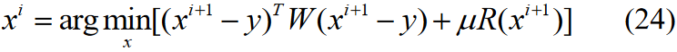  
可进一步求解为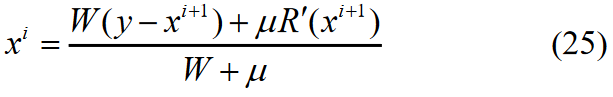  
为了减少噪声对重建效果的影响，将比例系数η设为22000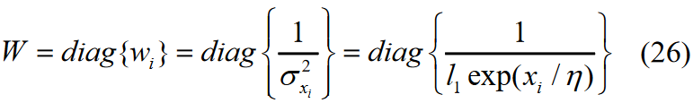

·校正器是指Langevin动力学，通过以下步骤将任意初始样本 x(t) 转换为最终样本x(0)：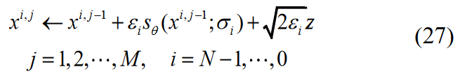  
其中，εi > 0 为步长，z~N(0, 1)指一个标准的正态分布。Langevin动力学理论保证当M → ∞ 并且 εi → 0 时，xi是在特定条件下来自pt(x) 的样本。

·式(8)中的DC可以看作是一个条件项纳入到等式(27)中并且产生：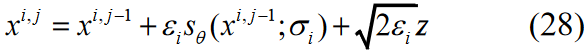

·当得到重建的投影x，就可以得到最终的图像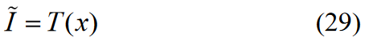  
其中T(·)代表滤波反投影(FBP).

·OSDM的迭代重建过程如下图：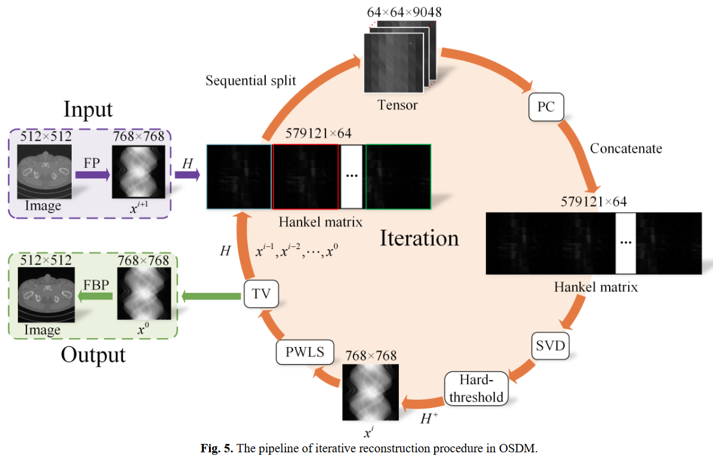)

·算法：训练阶段只需要一个sinogram样本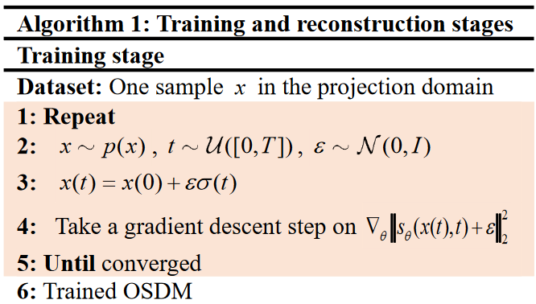

·算法：整个OSDM重建过程包含两个循环，外层循环利用训练好的网络进行预测，在内层循环中执行校正器进行校正。预测器和校正器作为一个整体共同作用生成最终样本。在每个循环中更新预测和校正过程的数据先验项和数据保真项。重建阶段如下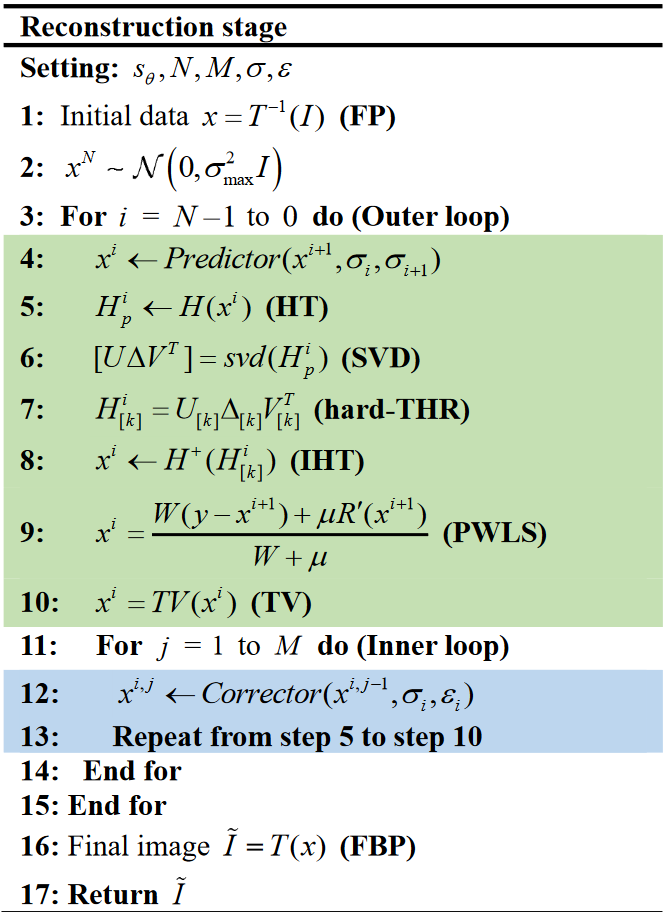)

## 4. Experiments

·训练数据集：AAPM数据集中，只有1个projection data用于OSMD训练，4700个projection data用于U-Net和CNN训练，所有模型都选取12个projection data作为测试集。

·测试数据集：在CQ500数据集上选取12个扫描进行测试。

·模型训练和参数选择：Adam算法，学习率为10-3并使用凯明初始化来初始化权重。

·评估指标：PSNR. SSIM, MSE

·实验对照：“FBP [2], SART-TV [48], CNN [49], and U-Net [50].”
